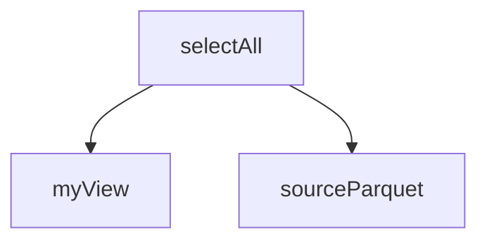
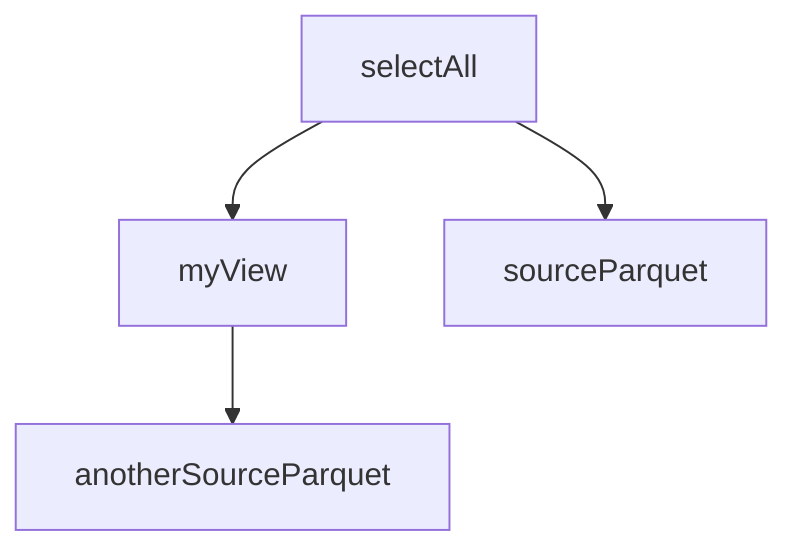
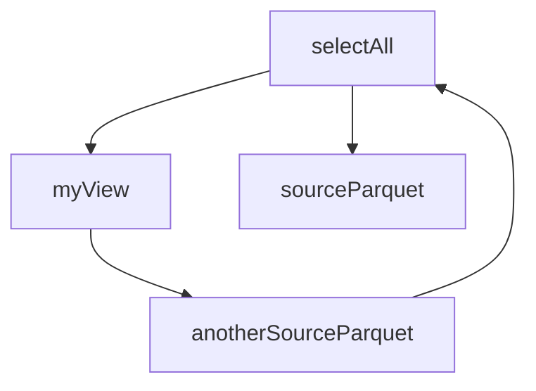

# Analog Delivery Monitoring

Analog Delivery Monitoring is a prototype project that allows developers, business analysts and anyone who can write 
SQL queries to create reports, statistics and KPIs about SEND data.

Below we will use the terms:
- __must__: to denote the mandatory nature of the concept
- __should__: to denote a non-mandatory concept but is good practice to follow

## How to create new report
The purpose of every report is to start a data pipeline in which multiple manipulations of the data are performed 
in order to produce a final result of interest.

All the manipulations may depend on each other, and these dependencies are resolved introducing a 
*Direct Acyclic Graph* because we want to ensure that every task is executed by following a topological ordering.

Each report should be created in JSON format within *reports* list in file 
*analog-delivery-monitoring/reports/ReportFleet.json*.

### Report Data Structure

_Report model_
| Parameter       | Type          | Description                                       | Default      |
| :-------------- | :------------ | :------------------------------------------------ | :----------- |
| `name`          | `string`      | **Mandatory** - Name of the report                | NA           |
| `version`       | `string`      | **Optional** - Version of the report              | ''           |
| `outputFormat`  | `enum`        | **Optional** - Output format of the report        | CSV          |
| `cron`          | `enum`        | **Optional** - Cron timing to start report        | DAILY        |
| `partitions`    | `number`      | **Optional** - Number of out partitions           | Spark choice |
| `partitionKeys` | `set<string>` | **Optional** - Columns used during partitioning   | []           |
| `task`          | `object`      | **Mandatory** - Leaf task information (see below) | NA           |

`outputFormat` possible values `CSV | PARQUET | JSON`  
`cron` possible values: `DAILY`

_Task model_
| Parameter      | Type     | Description                                          |
| :------------- | :------- | :--------------------------------------------------- |
| `name`         | `string` | **Mandatory** - Name of the  task                    |
| `type`         | `enum`   | **Mandatory** - Technical type of the task           |
| `script`       | `object` | **Mandatory** - Leaf task script (see below)         |

`type` possible values: `SQL`

_Script model_
| Parameter      | Type     | Description                                          |
| :------------- | :------- | :--------------------------------------------------- |
| `path`         | `string` | **Mandatory** - Path in which leaf task script lies  |
| `entry`        | `string` | **Mandatory** - The name of first command to execute |

Here an example of report(with optional parameters):
```json
{
  "name": "Shipper Reliability Report",
  "version": "1.0",
  "outputFormat": "CSV",
  "cron": "DAILY",
  "partitions": 1,
  "partitionKeys": [
    "columnA",
    "columnB"
  ],
  "task": {
    "name": "Build Shipper Reliability Report",
    "type": "SQL",
    "script": {
      "path": "analog-delivery-monitoring/queries/ShipperProductReliabilityReport.sql",
      "entry": "ShipperReliabilityReport"
    }
  }
}
```

Code reads ReportFleet json file in order to understand the leaf task nodes from which start building the 
Direct Acyclic Graph by resolving all declared dependencies.

In particular, the pre-processing phase (aka parsing phase) starts reading `reports[?].task.script` object in order to 
retrieve information about entry location and name; 
the couple _<location, name>_ uniquely identifies the last task to execute to create the report.

But how can I start writing new SQL queries with dependencies?

## How to create SQL query graph
Each SQL queries can be written using standard SQL language along with Spark build-in function to reach more 
complex query for specific use cases.

The most important part refers to dependency definition, 
because each SQL query surely will depend on other temporary or materialized views create by other queries.

In order to define dependencies, each query must be decorated with a SQL multiline comment 
`/* This is a multiline comment style */`, in which is defined a special keyword `$QueryMetadata` 
followed by a JSON object that contains all the meta information about the query.

### Meta information data structure

_Meta information model_
| Parameter      | Type      | Description                                          | Default           |
| :------------- | :-------- | :--------------------------------------------------- | :---------------- |
| `name`         | `string`  | **Mandatory** - Name assigned to query               | NA                |
| `persist`      | `boolean` | **Optional** - Enable caching for view               | depends on graph  |
| `dependencies` | `list`    | **Optional** - List of dependencies                  | []                |

`persist` if not specified caching will be applied evaluating the usage of the task node
`dependencies` can be null or empty and the meaning is that query does not depend on any other query

_Dependency model_
| Parameter      | Type     | Description                                          |
| :------------- | :------- | :--------------------------------------------------- |
| `name`         | `string` | **Mandatory** - Name assigned to target query        |
| `location`     | `list`   | **Mandatory** - File in which target query lies      |

Here an example of SQL query with dependencies:
```sql
/* 
$QueryMetadata
{
    "name": "selectAll",
    "dependencies": [
        {
            "name": "myView",
            "location": "analog-delivery-monitoring/logical-views/MyView.sql"
        },
        {
            "name": "sourceParquet",
            "location": "analog-delivery-monitoring/source-views/SourceParquet.sql"
        }
    ]
}
*/
SELECT * FROM myView mv LEFT JOIN sourceParquet sp on mv.id = sp.id
```

In the example above `selectAll` query depends on `myView` and `sourceParquet` queries each of them define 
a queryable view (in this example we are assuming that `myView` and `sourceParquet` have no dependencies).

Our graph should be like the following:



Let's suppose now that `myView` query depends on another one source:
```sql
/* 
$QueryMetadata
{
    "name": "myView",
    "dependencies": [
        {
            "name": "anotherSourceParquet",
            "location": "analog-delivery-monitoring/source-views/AnotherSourceParquet.sql"
        }
    ]
}
*/
CREATE OR REPLACE temporary view myView as
SELECT * FROM anotherSourceParquet asp WHERE asp.filename RLIKE(".*csv")
```

In that case our graph should be similar to the following:



What's happen if `anotherSourceParquet` depends on `selectAll` query?  
In this case we have a cycle in our graph, and we cannot talk about Direct Acyclic Graph; 
program will throw a `DependencyCycleException` because we cannot have circular dependencies.



Finally, each file can contain more SQL queries each of these decorated with the standard before.  
These queries can also depend on each other within the same file, but the logic still remain the same: 
building a Direct Acyclic Graph!

Here an example of multi SQL queries:

```sql
/* 
$QueryMetadata
{
    "name": "myView",
    "dependencies": [
        {
            "name": "sourceParquet",
            "location": "analog-delivery-monitoring/source-views/SourceParquet.sql"
        }
    ]
}
*/
CREATE OR REPLACE temporary view myView2 as
SELECT * FROM sourceParquet sp WHERE sp.code = 1234

/* 
$QueryMetadata
{
    "name": "myView",
    "dependencies": [
        {
            "name": "myView2",
            "location": "/samePath/sameSQLfile.sql"
        }
    ]
}
*/
SELECT * FROM myView2 mv2 WHERE mv2.id = 10
```

## How to launch new report
Every new report that use DAG structure must use the `TaskDagExecutorCommand` class 
annotated with `@Command(name = "taskDagExecutor")` of _picocli_ library.  
So it is sufficient to launch `taskDagExecutor` command to start the whole processing pipeline.

This command requires three mandatory arguments:
- `--report-fleet` - to provide the absolute path of the report fleet JSON file
- `--source-path` - to provide the root path of the current machine
- `--export-bucket` - to provide the S3 bucket in which save report

Here an example of command execution:

```bash
taskDagExecutor \
  --report-fleet ${resource_root}/analog-delivery-monitoring/reports/ReportFleet.json \
  --source-path ${resource_root} \
  --export-bucket ${export_bucket_name}
```

Since we have a single ReportFleet.json file with all reports, when the command `TaskDagExecutorCommand` 
is run all the reports will be run.